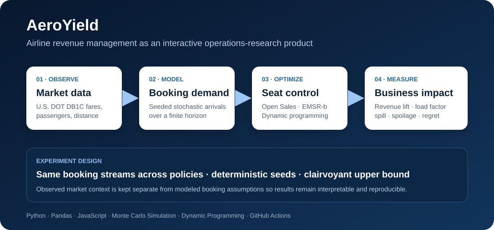

# AeroYield — Airline Revenue Optimizer

[](https://github.com/normanlrasmussen/airline-revenue-optimizer/actions/workflows/ci.yml)
[](https://github.com/normanlrasmussen/airline-revenue-optimizer/actions/workflows/pages.yml)

**AeroYield is an interactive operations-research project that uses U.S. airline market data, stochastic booking simulation, optimization, and a trained neural policy to quantify the value of better seat-control decisions.**

**[Live Demo](https://normanlrasmussen.github.io/airline-revenue-optimizer/)** · **[Revenue Optimizer](https://normanlrasmussen.github.io/airline-revenue-optimizer/optimizer.html)** · **[Methodology](METHODOLOGY.md)**



## Why it matters

An airline seat is **perishable inventory**: after departure, an empty seat has no sale value. But accepting every early request can also destroy value by displacing customers who arrive later and are willing to pay more.

AeroYield turns that trade-off into a sequential decision problem: **accept this booking now, or preserve capacity for uncertain future demand?** Real U.S. market data provides route context, a deliberately noisy simulator generates booking outcomes, and multiple revenue-management policies are evaluated on the same realized customer streams.

## Portfolio highlights

- **Data engineering:** processes U.S. DOT DB1C market data into route-level fares, passengers, distance, yield, carrier share, and monthly trends.
- **Operations research:** implements EMSR-b, finite-horizon dynamic programming, deterministic LP bid-price control, Bayesian adaptive DP, and distributionally robust DP.
- **Machine learning:** trains an MLP policy to imitate finite-horizon DP decisions using only information available at booking time, then exports the model for browser inference.
- **Stochastic experimentation:** separates the forecast from the realized world using correlated demand shocks, booking-timing error, multi-seat parties, cancellations, no-shows, refunds, and controlled overbooking.
- **Decision support:** reports net revenue lift, load factor, spill, spoilage, denied boarding, regret, protection levels, bid prices, and uncertainty ranges.
- **Reproducibility:** uses deterministic seeds, common random numbers across policies, automated tests, CI, and GitHub Pages deployment.

**Tech stack:** Python · Pandas · NumPy · SciPy · scikit-learn · PyArrow · JavaScript · Dynamic Programming · Linear Programming · Bayesian Updating · Robust Optimization · Monte Carlo Simulation · GitHub Actions · GitHub Pages

## Product workflow

**Observed DB1C market data → baseline demand forecast → noisy realized bookings → seat-control policies → net revenue comparison**

The website includes:

- **The Problem** — plain-language explanation of single-flight airline revenue management.
- **Market Data** — route screening, passenger/fare trends, distance-normalized yield, and carrier-share context.
- **Route Detail** — commercial drill-down for one directional market before testing controls.
- **Revenue Optimizer** — a simulation workbench that compares all implemented policies against identical seeded booking streams.

Observed market data and modeled booking assumptions are kept explicitly separate throughout the site.

## Revenue-management methods

| Method | Decision rule | Information available |
| --- | --- | --- |
| **Open Sales** | Accept every party while it fits under the booking limit. | Current inventory |
| **EMSR-b** | Protect capacity from lower fares using forecast higher-fare demand. | Baseline demand forecast |
| **Finite-horizon DP** | Use time-varying forecast seat opportunity costs. | Baseline period-by-period forecast |
| **Deterministic LP** | Use the marginal value of capacity from the remaining expected-demand relaxation as a bid price. | Baseline remaining-demand forecast |
| **Bayesian Adaptive DP** | Update a demand multiplier from observed booking pace and select the nearest pre-solved DP. | Baseline forecast + bookings observed so far |
| **Distributionally Robust DP** | Optimize Bellman values against request distributions inside a total-variation ambiguity set. | Baseline forecast + configured uncertainty |
| **Neural Network** | Approximate DP accept/reject decisions with a trained MLP. | Booking-time state + baseline forecast features |
| **Oracle** | Optimize with knowledge of realized requests, cancellations, and no-shows. | Perfect future information; benchmark only |

Every deployable policy obeys the same information boundary: it does **not** receive future realized arrivals, future cancellations, future no-shows, or the hidden realized demand shock. The Oracle is intentionally unattainable and is used only as a perfect-information upper bound.

### Finite-horizon DP

The baseline DP uses state `(booking period, remaining booking capacity)` and Bellman recursion

\[
V_t(c)
=
\hat p_{t,0}V_{t+1}(c)
+
\sum_k
\hat p_{t,k}
\max\left\{V_{t+1}(c),\;f_k+V_{t+1}(c-1)\right\}.
\]

The implied one-seat bid price is

\[
V_{t+1}(c)-V_{t+1}(c-1).
\]

For multi-seat requests, AeroYield sums the relevant per-seat opportunity costs. The DP is exact for its internal forecast model, not for the richer realized simulation or a real airline.

### Neural policy

The neural policy is trained locally by distilling the finite-horizon DP. Its features are restricted to information available at decision time: booking progress, remaining capacity, party size, fare information, baseline demand, and current forecast request probabilities.

```bash
python neural_network/train_policy.py
```

Training saves:

- `site/data/nn_policy.json` — browser-deployable model weights and scaling data
- `neural_network/training_loss.png` — convergence curve
- `neural_network/training_metrics.json` — holdout metrics and loss history

The other optimization policies do not require offline training.

See [`optimization/ADVANCED_POLICIES.md`](optimization/ADVANCED_POLICIES.md) and [`neural_network/README.md`](neural_network/README.md) for implementation details and guarantees.

## Observed data vs. modeled assumptions

**Observed / DB1C-derived when available**

- origin and destination
- passenger weight
- average fare
- reporting carrier
- market distance
- year and month

**Derived from observed data**

- passenger-weighted average fare
- estimated market value (`average fare × observed passengers`)
- yield per passenger-mile
- reporting-carrier passenger shares
- monthly network and route trends

**Modeled for experimentation**

- Saver / Main / Flex fare groups
- baseline expected demand by fare group
- booking-arrival timing profiles
- forecast error and timing perturbations
- party sizes
- cancellations and refund fraction
- no-shows
- overbooking limit
- denied-boarding compensation

DB1C does **not** provide purchase date, days-before-departure, realized booking class, cancellation history, or no-show behavior used by the simulation. Simulation results are experiments, not airline accounting results.

## Stochastic simulation

The booking horizon uses four request opportunities per day from D-180 through departure. Each Monte Carlo replication creates a hidden realized world with:

- market-wide and class-specific demand shocks;
- booking-timing shifts and persistent day-level booking variation;
- random parties of 1–4 seats;
- lead-time-dependent cancellations;
- departure no-shows;
- configurable refunds and overbooking.

Within each replication, every policy receives the same realized customer stream. This common-random-number design makes differences primarily attributable to the control rule rather than different random draws.

The optimizer reports average net revenue, lift versus Open Sales, percentile revenue ranges, load factor, rejected seats, cancellations, no-shows, empty seats, denied boarding, average sold fare, and regret versus the Oracle.

## Quick start

```bash
python -m venv .venv
source .venv/bin/activate      # Windows: .venv\Scripts\activate
pip install -r requirements.txt
pytest -q
python -m http.server 8000 --directory site
```

Then open `http://localhost:8000`.

## Build the market data

Download the newest BTS Market file:

```bash
python data/download_db1c.py --dataset market --latest
```

Process the raw DB1C files and rebuild the site summary:

```bash
python data/process_db1c.py \
  --input data/raw \
  --output data/processed/markets.parquet \
  --site-summary site/data/market_summary.json \
  --chunksize 100000
```

## Repository layout

```text
.
├── data/                       # DB1C download and processing pipeline
├── neural_network/
│   ├── train_policy.py         # local MLP training/export
│   ├── training_loss.png
│   └── training_metrics.json
├── optimization/
│   ├── revenue_management.py
│   ├── simulation.py
│   └── ADVANCED_POLICIES.md
├── site/
│   ├── index.html
│   ├── market.html
│   ├── data.html / data.js
│   ├── route.html / route.js
│   ├── optimizer.html / app.js
│   ├── rm.js / simulation.js
│   ├── neural_policy.js
│   ├── advanced_policies.js
│   └── data/
│       ├── market_summary.json
│       └── nn_policy.json
├── tests/
└── .github/workflows/
    ├── ci.yml
    └── pages.yml
```

## Tests and CI

CI runs on pushes to `main` and pull requests:

```bash
pytest -q
python -m compileall -q data optimization tests
for file in site/*.js; do node --check "$file"; done
```

Tests cover the data pipeline, revenue-management math, stochastic simulation, advanced policies, information-boundary assumptions, and static-site wiring.

## Current scope

The project is intentionally scoped to **single-flight seat inventory control**. The simulation includes imperfect demand forecasts, multi-seat requests, cancellations, no-shows, refunds, overbooking, and denied-boarding costs, but those are scenario models rather than empirically calibrated airline behavior.

Natural extensions include network revenue management, optimized overbooking, airline-specific availability data, calibrated demand/attrition models, competitive price response, and approximate dynamic programming for larger state spaces.

## Data source

The data pipeline is designed for the U.S. Department of Transportation Bureau of Transportation Statistics Origin & Destination Survey (DB1C / OD40):

https://www.bts.gov/topics/airlines-and-airports/origin-and-destination-survey-data

GitHub Pages deploys the `site/` directory automatically after changes reach `main`.
